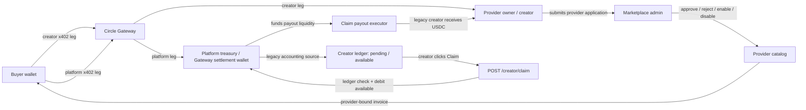

# QMA - Quant Memory Agent

QMA is a pay-per-call market intelligence agent on Arc.

Humans and AI agents can buy historical crypto market-memory reports one query at a time using Arc Testnet USDC through Circle Gateway/x402.

## Judge TL;DR

- Live app: https://qma-three.vercel.app
- API: https://qma-api.onrender.com
- Arc Gateway: https://qma-arc-gateway.onrender.com
- Marketplace: `/marketplace`
- Core flow: Agent Picks -> Preview or Full invoice -> Circle Gateway/x402 payment -> wallet-bound entitlement -> paid JSON report.
- Agent demo: see [docs/AGENT_API.md](docs/AGENT_API.md) and `examples/agent_buyer.mjs`.
- Security model: frontend cache is convenience only; backend verifies invoice secret, query hash, tier, provider, payer wallet, x402 settlement, access token expiry, rate limits, and wallet-bound entitlements.

Try:

```text
1. Open the live app and click Launch App.
2. Connect a buyer wallet on Arc Testnet.
3. If the wallet needs testnet USDC, use the Circle Faucet: https://faucet.circle.com/
4. Buy Preview for 0.001 USDC or Full for 0.005 USDC.
5. Open Wallet Profile to see report history and spend.
6. Run npm run agent:dry to see an external buyer agent choose and invoice a report.
```

## What This Repo Contains

- FastAPI backend with OpenAPI docs at `/docs`
- Terminal-style QMA dashboard at `/app`
- Provider marketplace and creator application page at `/marketplace`
- Short hackathon landing page at `/`
- Paid Intelligence API Kit
- Provider interface with `funding_memory` and experimental `oi_memory` providers
- Arc/Circle x402 gateway sidecar
- Public sample datasets for local testing

## Repository Layout

```text
qma/
  main.py                 FastAPI backend and HTML/API routes
  qma_engine.py           historical analog engine
  providers.py            paid intelligence provider registry
  storage.py              JSON/Supabase persistence layer
  index.html              landing page served at /
  app.html                QMA dashboard served at /app
  user.html               wallet profile/history served at /user
  marketplace.html        provider marketplace served at /marketplace
  public/                 shared JS, CSS, and image assets
  docs/                   Arc, Supabase, API security, Cloudflare, demo notes
  examples/               autonomous buyer agent example
  scripts/                migration/util scripts
  data/                   public sample datasets
  paid_intelligence_kit/  reusable paid API primitive
```

## Docs

- [docs/AGENT_API.md](docs/AGENT_API.md): external autonomous buyer example.
- [examples/README.md](examples/README.md): CLI buyer demo commands.
- [docs/ARC_PAYMENT.md](docs/ARC_PAYMENT.md): Circle Gateway/x402 payment lifecycle.
- [docs/SUPABASE.md](docs/SUPABASE.md): durable payment/entitlement/creator storage.
- [docs/API_SECURITY.md](docs/API_SECURITY.md): backend authorization, rate limits, and marketplace endpoints.
- [docs/CLOUDFLARE.md](docs/CLOUDFLARE.md): Cloudflare setup for edge protection.
- [docs/PRODUCTIZATION.md](docs/PRODUCTIZATION.md): vNext product architecture and marketplace roadmap.
- [docs/DECISIONS.md](docs/DECISIONS.md): product and architecture decision log.
- [docs/TRACTION.md](docs/TRACTION.md): metrics/proof policy for real usage and creator claims.

## Product Flow

1. QMA scans live MEXC funding anomalies.
2. Agent Picks ranks which reports are worth buying.
3. User or external agent selects a provider and creates a provider-bound invoice.
4. Buyer pays `0.001 USDC` for Preview or `0.005 USDC` for Full.
5. QMA verifies Circle Gateway settlement and records a wallet entitlement.
6. The exact query-bound report unlocks.

## Money Roles And Settlement Model

QMA intentionally separates money roles. In vNext, provider purchases use direct x402 split legs: creator revenue settles to the provider revenue wallet, and platform fees settle to the platform treasury. Legacy `treasury_ledger` providers can still settle first into the treasury wallet and pay creators through the claim flow.

| Role | Current address | Purpose |
| --- | --- | --- |
| Marketplace admin | `0x1c684cd494d940418e271d51c889486e27c0aed0` | Reviews provider applications, approves/rejects creators, and manages provider availability. Admin does not receive settlement funds. |
| Platform treasury / Gateway settlement wallet | `0x23e7c029a287a83d80b2e084e008211658dda11d` | Receives the platform leg of direct x402 split payments. Legacy treasury-ledger payments can still settle here. |
| Provider owner / creator | Any approved provider owner wallet, for example `funding_memory` owner `0xb40971a5d88f31c7b8d88bf93f7d044f1383bf01` | Owns a provider/data product and receives the creator leg of direct x402 split payments into its Gateway balance. |
| Claim payout executor / relayer | `0xe29d54cf74b3a3b0be7d2e2274e68539daab651b` | Hot wallet that executes creator claim payouts in the MVP and can also sponsor gas for treasury withdrawals. It does not own provider earnings or admin permissions. |



Current behavior:

- Buyers pay one x402 leg to the creator revenue wallet and one x402 leg to the platform treasury.
- Provider owners can see direct-settled earnings for split providers. Legacy ledger providers still show pending/available claim balances.
- The treasury wallet performs the real Gateway withdrawal because it is the current Gateway depositor.
- The payout executor/relayer sends MVP creator claim transfers and sponsors gas for relayed withdrawals; it should hold a small operating USDC balance funded from treasury/platform fees.
- Future versions can replace treasury payout execution with direct settlement or a revenue split contract without rewriting the creator dashboard.

Recommended claim path for the current architecture:

1. Keep buyer settlement centralized in the platform treasury.
2. Track creator earnings in the QMA split ledger per provider owner wallet.
3. Show creator balances as `pending` and `available` in the dashboard.
4. Let the creator initiate payout with a Claim action.
5. On claim, the backend verifies the ledger, debits available balance, and asks the configured payout executor hot wallet to transfer USDC on-chain to the creator. A later contract/meta-transaction version can split treasury signing from relayer gas sponsorship.
6. Record claim status (`requested`, `paid`, `failed`), amount, provider, creator wallet, and transaction hash.
7. Do not run automatic daily treasury transfers by default; creator-initiated claim keeps payout timing and transaction history visible to the creator.

## Agent Buyer Flow

```text
signal -> invoice -> x402 pay -> JSON report
```

QMA supports human buyers through the web app and autonomous buyers through the paid API path. An external agent can evaluate a suggested signal, create an invoice, pay within a budget, and receive a structured report response without using the dashboard.

## Data Policy

The public repo includes sample CSVs:

```text
qma/data/sample_funding_historical_analysis.csv
qma/data/sample_trading_analysis.csv
```

The deployed demo can use a larger private provider dataset through environment variables:

```env
QMA_HISTORICAL_DB_PATH=/private_data/funding_historical_analysis.csv
QMA_BACKTEST_OUTCOME_PATH=/private_data/trading_analysis.csv
```

The data source is MEXC Futures public API. Public sample data plus crawler scripts are included for transparency; the full dataset is treated as a provider asset.

Live market APIs are normalized before they reach paid providers:

```text
exchange API -> MarketDataAdapter -> canonical QMA signal -> IntelligenceProvider
```

For MEXC Futures, `market_data.py` caches `contract/detailV2?client=web` under `data/cache/` and uses `cs` contract size when converting ticker `holdVol` into open-interest notional:

```text
openInterest = holdVol * cs * lastPrice
```

This keeps exchange-specific fields out of `providers.py`. A new exchange should add a new adapter that emits the same canonical keys (`symbol`, `fundingRate`, `marketCap`, `volume24h`, `openInterest`, `amount`, etc.) instead of rewriting provider/payment/report logic.

## Recommended Hackathon Deployment

Use the landing/dashboard on Vercel if you want a clean public URL, and run the backend/API plus private data on Railway, Render, or a VPS.

Vercel can deploy FastAPI, but QMA uses pandas, scipy, sklearn, live scanning, and optionally a private dataset. Keeping the backend separate is safer for bundle size and long-running reliability.

Suggested setup:

```text
Vercel:
  - landing page
  - frontend shell

Railway / Render / VPS:
  - FastAPI backend
  - QMA engine
  - Arc Gateway sidecar
  - private full dataset
```

This repo includes:

```text
render.yaml   Render blueprint for qma-api + qma-arc-gateway
vercel.json   Static landing/dashboard routes: /, /app, /user, /marketplace
.vercelignore Keeps Vercel from deploying the Python/Node backend files
*.html        Vercel and FastAPI served HTML entrypoints
public/       Shared CSS, JS, and assets
```

After Render creates both services, set these environment variables:

```env
# qma-api service
QMA_ARC_SELLER_ADDRESS=<seller-wallet>
QMA_FUNDING_MEMORY_OWNER_WALLET=<seller-wallet>
QMA_ARC_GATEWAY_URL=https://qma-arc-gateway.onrender.com

# qma-arc-gateway service
QMA_ARC_SELLER_ADDRESS=<seller-wallet>
```

After Vercel deploys the static frontend, set the API base in `index.html`, `app.html`, `user.html`, and `marketplace.html` or inject it before build:

```html
window.QMA_API_BASE_URL = "https://qma-api.onrender.com";
```

If the static UI is deployed separately from the API, set:

```html
<script>
  window.QMA_API_BASE_URL = "https://your-qma-api.example.com";
</script>
```

The same variable is supported by all static pages.

In Vercel project settings, use:

```text
Framework Preset: Other
Root Directory: repo root
Build Command: empty
Output Directory: empty
Install Command: empty
```

If Vercel shows "This Serverless Function has crashed", it is trying to deploy the backend. The static frontend deployment should include the root HTML entrypoints, `public/`, `vercel.json`, and `.vercelignore`.

Vercel notes: their docs support FastAPI/Python deployments, but Python functions have a 500 MB uncompressed bundle size limit and Python files are not tree-shaken automatically. For QMA, that makes split deployment the practical default.

## Local Run

Use local first, then push to GitHub only after the wallet/payment flow is OK. The HTML files auto-detect the environment:

```text
http://127.0.0.1:8000  -> same-origin local FastAPI API
https://qma-three.vercel.app -> https://qma-api.onrender.com
```

Local terminal 1:

```powershell
python qma\main.py
```

Local terminal 2:

```powershell
cd qma\arc_gateway
npm.cmd install
npm.cmd start
```

Local `.env` should point FastAPI at the local Arc Gateway:

```env
QMA_ARC_GATEWAY_URL=http://127.0.0.1:3000
```

Open:

```text
http://127.0.0.1:8000
http://127.0.0.1:8000/app
```

Useful endpoints:

```text
GET  /api/v1/providers
GET  /api/v1/providers/funding_memory
POST /api/v1/payment/invoice
POST /api/v1/payment/verify
POST /api/v1/providers/funding_memory/preview
POST /api/v1/providers/funding_memory/full-report
```
