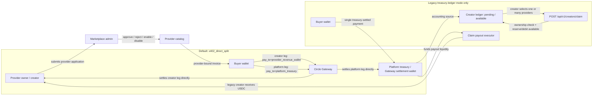

# QMA - Quant Memory Agent

QMA is a pay-per-call market intelligence agent on Arc.

Humans and AI agents can buy historical crypto market-memory reports one query at a time using Arc Testnet USDC through Circle Gateway/x402.

## Judge TL;DR

- Live app: https://qma-three.vercel.app
- API: https://qma-api.onrender.com
- Arc Gateway: https://qma-arc-gateway.onrender.com
- Marketplace: `/marketplace`
- Core flow: Agent Picks -> Preview or Full invoice -> Circle Gateway/x402 payment -> wallet-bound entitlement -> paid JSON report.
- Agent demo: see [docs/AGENT_API.md](docs/AGENT_API.md) and `examples/agent_buyer.mjs`.
- Security model: frontend cache is convenience only; backend verifies invoice secret, query hash, tier, provider, payer wallet, x402 settlement, access token expiry, rate limits, and wallet-bound entitlements.

Try:

```text
1. Open the live app and click Launch App.
2. Connect a buyer wallet on Arc Testnet.
3. If the wallet needs testnet USDC, use the Circle Faucet: https://faucet.circle.com/
4. Buy Preview for 0.001 USDC or Full for 0.005 USDC.
5. Open Wallet Profile to see report history and spend.
6. Run npm run agent:dry to see an external buyer agent choose and invoice a report.
```

## What This Repo Contains

- FastAPI backend with OpenAPI docs at `/docs`
- Legacy terminal-style QMA dashboard at `/app` on the live `main` branch
- Legacy provider marketplace and creator application page at `/marketplace` on `main`
- Vite + React rebuild under `frontend/src/`, intended to replace the legacy UI after cutover
- Short hackathon landing page at `/` on the live legacy deployment
- Paid Intelligence API Kit
- Provider interface with `funding_memory` and experimental `oi_memory` providers
- Arc/Circle x402 gateway sidecar
- Public sample datasets for local testing

## Repository Layout

```text
qma/
  main.py                 Render-compatible FastAPI shim used by the live deployment
  backend/app/            FastAPI source: api/v1/endpoints, core, repositories, schemas, services
  frontend/src/           Vite + React + TypeScript source: app, components, hooks, services, state, types, utils
  frontend/dist/           generated Vite output; never edit directly
  frontend/package.json    React rebuild scripts and dependencies
  qma_engine.py           historical analog engine
  providers.py            paid intelligence provider registry
  storage.py              JSON/Supabase persistence layer
  index.html              live legacy landing page served at / on main
  app.html                live legacy dashboard served at /app on main
  user.html               live legacy wallet profile/history served at /user on main
  marketplace.html        live legacy marketplace served at /marketplace on main
  public/                 live legacy JS, CSS, and image assets
  docs/                   Arc, Supabase, API security, Cloudflare, demo notes
  examples/               autonomous buyer agent example
  scripts/                migration/util scripts
  data/                   public sample datasets
  paid_intelligence_kit/  reusable paid API primitive
```

The repository currently contains two intentionally parallel frontend
realities. The live `main` deployment uses the root `*.html` files, `public/`,
and the root `main.py` shim. The `frontend/vite-react-rebuild` branch is the
active React implementation; its production deployment is configured to
build `frontend/dist/`, but permanent cutover has not been confirmed.

## Docs

- [docs/AGENT_API.md](docs/AGENT_API.md): external autonomous buyer example.
- [examples/README.md](examples/README.md): CLI buyer demo commands.
- [docs/ARC_PAYMENT.md](docs/ARC_PAYMENT.md): Circle Gateway/x402 payment lifecycle.
- [docs/SUPABASE.md](docs/SUPABASE.md): durable payment/entitlement/creator storage.
- [docs/API_SECURITY.md](docs/API_SECURITY.md): backend authorization, rate limits, and marketplace endpoints.
- [docs/CLOUDFLARE.md](docs/CLOUDFLARE.md): Cloudflare setup for edge protection.
- [docs/PRODUCTIZATION.md](docs/PRODUCTIZATION.md): vNext product architecture and marketplace roadmap.
- [docs/DECISIONS.md](docs/DECISIONS.md): product and architecture decision log.
- [docs/TRACTION.md](docs/TRACTION.md): metrics/proof policy for real usage and creator claims.

## Product Flow

1. QMA scans live MEXC funding anomalies.
2. Agent Picks ranks which reports are worth buying.
3. User or external agent selects a provider and creates a provider-bound invoice.
4. Buyer pays `0.001 USDC` for Preview or `0.005 USDC` for Full.
5. QMA verifies Circle Gateway settlement and records a wallet entitlement.
6. The exact query-bound report unlocks.

## Money Roles And Settlement Model

QMA intentionally separates money roles. The default settlement mode is `x402_direct_split`: every provider-bound purchase creates independent x402 legs. The creator leg has `pay_to=provider_revenue_wallet`, so creator revenue settles directly to the provider revenue wallet's Circle Gateway balance. The platform leg has `pay_to=platform_treasury`, so platform fees settle separately to treasury.

Legacy `treasury_ledger` providers are different. They settle into treasury first, then the QMA creator ledger tracks provider-owner balances until the creator selects one or more providers and clicks Claim.

| Role | Current address | Purpose |
| --- | --- | --- |
| Marketplace admin | `0x1c684cd494d940418e271d51c889486e27c0aed0` | Reviews provider applications, approves/rejects creators, and manages provider availability. Admin does not receive settlement funds. |
| Platform treasury / Gateway settlement wallet | `0x23e7c029a287a83d80b2e084e008211658dda11d` | Receives the platform leg of direct x402 split payments. Legacy treasury-ledger payments can still settle here. |
| Provider owner / creator | Any approved provider owner wallet, for example `funding_memory` owner `0xb40971a5d88f31c7b8d88bf93f7d044f1383bf01` | Owns a provider/data product and receives the creator leg of direct x402 split payments into its Gateway balance. |
| Claim payout executor / relayer | `0xe29d54cf74b3a3b0be7d2e2274e68539daab651b` | Hot wallet that executes creator claim payouts in the MVP and can also sponsor gas for treasury withdrawals. It does not own provider earnings or admin permissions. |



Current behavior:

- Buyers normally sign/pay two independent x402 legs: creator and platform.
- Direct-split creator earnings are not claimable ledger debt. They already belong to the provider revenue wallet as Gateway balance. The creator can select provider rows in the dashboard for accounting visibility, then withdraw the connected revenue wallet's Gateway balance.
- Legacy ledger providers still show `pending`, `available`, `requested`, `paid`, and `failed` claim balances. The creator can select one or many providers and submit one batched claim.
- Gateway withdrawal is wallet-level, not provider-level. If one revenue wallet owns three providers, selecting those providers filters the displayed accounting totals, but the signed Gateway `BurnIntent` withdraws from that connected wallet's Gateway balance.
- A split invoice unlocks access only when all required legs are paid/final. If one leg succeeds and another later fails, QMA marks the invoice `disputed` and does not issue a new access token. Already-settled money cannot be revoked because x402 split legs are independent payments, not escrow.
- The payout executor/relayer sends MVP legacy creator claim transfers and can sponsor gas for relayed withdrawals; it should hold a small operating USDC balance funded from treasury/platform fees.

```mermaid
sequenceDiagram
    autonumber
    actor Buyer
    participant Web as QMA Web/API
    participant Gateway as Circle Gateway + x402
    participant Creator as Provider revenue wallet
    participant Treasury as Platform treasury
    participant Ledger as QMA creator ledger
    participant Relayer as Claim payout executor

    Buyer->>Web: Select provider, tier, and query
    Web->>Web: Create provider-bound invoice
    Web->>Web: Build split legs from provider revenue_share_bps

    par creator split leg
        Buyer->>Gateway: Sign/pay x402 leg to provider_revenue_wallet
        Gateway-->>Creator: Creator leg settles to Gateway balance
    and platform split leg
        Buyer->>Gateway: Sign/pay x402 leg to platform_treasury
        Gateway-->>Treasury: Platform leg settles to Gateway balance
    end

    Gateway-->>Web: Return settlement receipts per leg
    Web->>Web: Verify all required legs and issue report access

    alt default direct split
        Creator->>Web: Open Creator Earnings
        Creator->>Web: Select one or many provider rows
        Web-->>Creator: Show selected accounting totals and withdrawable Gateway balance
        Creator->>Web: Sign Gateway BurnIntent
        Web->>Gateway: POST /api/v1/payment/withdraw
        Gateway-->>Creator: Mint/relay wallet USDC
    else legacy treasury-ledger provider
        Web->>Ledger: Move creator share from pending to available after final settlement
        Creator->>Web: Select one or many providers and click Claim
        Web->>Ledger: Verify ownership, amount, and signature
        Web->>Ledger: Reserve/debit available claim balance
        Web->>Relayer: Request USDC payout
        Relayer-->>Creator: Transfer USDC to creator wallet
        Web->>Ledger: Record claim status and tx hash
    end

    opt one split leg fails after another leg paid
        Web->>Web: Mark invoice disputed and block new access token
        Note over Creator,Treasury: Paid leg remains settled; it is not escrowed or reversible.
    end
```

## Agent Buyer Flow

```text
signal -> invoice -> x402 pay -> JSON report
```

QMA supports human buyers through the web app and autonomous buyers through the paid API path. An external agent can evaluate a suggested signal, create an invoice, pay within a budget, and receive a structured report response without using the dashboard.

## Data Policy

The public repo includes sample CSVs:

```text
qma/data/sample_funding_historical_analysis.csv
qma/data/sample_trading_analysis.csv
```

The deployed demo can use a larger private provider dataset through environment variables:

```env
QMA_HISTORICAL_DB_PATH=/private_data/funding_historical_analysis.csv
QMA_BACKTEST_OUTCOME_PATH=/private_data/trading_analysis.csv
```

The data source is MEXC Futures public API. Public sample data plus crawler scripts are included for transparency; the full dataset is treated as a provider asset.

Live market APIs are normalized before they reach paid providers:

```text
exchange API -> MarketDataAdapter -> canonical QMA signal -> IntelligenceProvider
```

For MEXC Futures, `market_data.py` caches `contract/detailV2?client=web` under `data/cache/` and uses `cs` contract size when converting ticker `holdVol` into open-interest notional:

```text
openInterest = holdVol * cs * lastPrice
```

This keeps exchange-specific fields out of `providers.py`. A new exchange should add a new adapter that emits the same canonical keys (`symbol`, `fundingRate`, `marketCap`, `volume24h`, `openInterest`, `amount`, etc.) instead of rewriting provider/payment/report logic.

## Recommended Hackathon Deployment

Use the landing/dashboard on Vercel if you want a clean public URL, and run the backend/API plus private data on Railway, Render, or a VPS.

Vercel can deploy FastAPI, but QMA uses pandas, scipy, sklearn, live scanning, and optionally a private dataset. Keeping the backend separate is safer for bundle size and long-running reliability.

Suggested setup:

```text
Vercel:
  - landing page
  - frontend shell

Railway / Render / VPS:
  - FastAPI backend
  - QMA engine
  - Arc Gateway sidecar
  - private full dataset
```

The live deployment and the React rebuild use different Vercel/Render
boundaries until cutover. This repo includes:

```text
render.yaml   Render blueprint; qma-api starts with the root main.py shim
vercel.json   React rebuild deployment: Vite build to frontend/dist/
.vercelignore Keeps Vercel from deploying the Python/Node backend files
*.html        Live legacy Vercel/FastAPI HTML entrypoints on main
public/       Live legacy shared CSS, JS, and assets
frontend/src/ React rebuild source
```

Deployment status confirmed from repository configuration and root
`AGENTS.md`: `main` remains the live legacy deployment, while
`frontend/vite-react-rebuild` is the development/cutover branch. The current
branch's `vercel.json` is configured with `framework: vite`, installs from
`frontend/`, runs `npm run build`, and publishes `frontend/dist/`; that config
does not by itself prove that production traffic has already switched.

After Render creates both services, set these environment variables:

```env
# qma-api service
QMA_ARC_SELLER_ADDRESS=<seller-wallet>
QMA_FUNDING_MEMORY_OWNER_WALLET=<seller-wallet>
QMA_ARC_GATEWAY_URL=https://qma-arc-gateway.onrender.com

# qma-arc-gateway service
QMA_ARC_SELLER_ADDRESS=<seller-wallet>
```

After Vercel deploys the static frontend, set the API base in `index.html`, `app.html`, `user.html`, and `marketplace.html` or inject it before build:

```html
window.QMA_API_BASE_URL = "https://qma-api.onrender.com";
```

If the static UI is deployed separately from the API, set:

```html
<script>
  window.QMA_API_BASE_URL = "https://your-qma-api.example.com";
</script>
```

The same variable is supported by all static pages.

For the legacy `main` deployment, the historical Vercel project settings are:

```text
Framework Preset: Other
Root Directory: repo root
Build Command: empty
Output Directory: empty
Install Command: empty
```

If Vercel shows "This Serverless Function has crashed", it is trying to deploy the backend. The static frontend deployment should include the root HTML entrypoints, `public/`, `vercel.json`, and `.vercelignore`.

For `frontend/vite-react-rebuild`, use the checked-in `vercel.json` instead of
the legacy settings above: install with `cd frontend && npm ci`, build with
`cd frontend && npm run build`, and publish `frontend/dist`.

Vercel notes: their docs support FastAPI/Python deployments, but Python functions have a 500 MB uncompressed bundle size limit and Python files are not tree-shaken automatically. For QMA, that makes split deployment the practical default.

## Local Run

Use local first, then push to GitHub only after the wallet/payment flow is OK. The HTML files auto-detect the environment:

```text
http://127.0.0.1:8000  -> same-origin local FastAPI API
https://qma-three.vercel.app -> https://qma-api.onrender.com
```

Local terminal 1:

```powershell
python qma\main.py
```

To run the React rebuild locally instead of the live legacy pages:

```powershell
cd qma\frontend
npm.cmd install
npm.cmd run dev
```

The React rebuild uses `VITE_QMA_API_BASE_URL` for its API base. The legacy
HTML pages continue to use `window.QMA_API_BASE_URL` as documented below.

Local terminal 2:

```powershell
cd qma\arc_gateway
npm.cmd install
npm.cmd start
```

Local `.env` should point FastAPI at the local Arc Gateway:

```env
QMA_ARC_GATEWAY_URL=http://127.0.0.1:3000
```

Open:

```text
http://127.0.0.1:8000
http://127.0.0.1:8000/app
```

Useful endpoints:

```text
GET  /api/v1/providers
GET  /api/v1/providers/funding_memory
POST /api/v1/payment/invoice
POST /api/v1/payment/verify
POST /api/v1/providers/funding_memory/preview
POST /api/v1/providers/funding_memory/full-report
```
