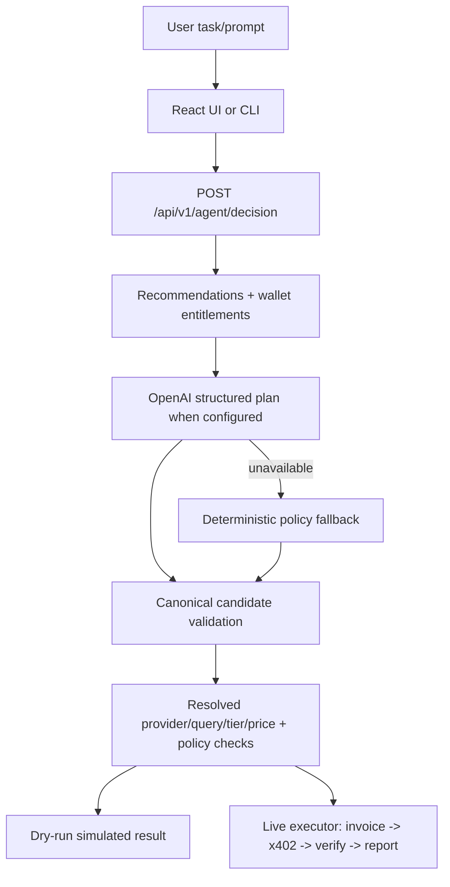

# QMA Agents

`agents/` is the typed policy/session package shared by the autonomous-agent
tooling. It is not the payment service and it is not the browser UI.

The current production decision boundary is the backend
`POST /api/v1/agent/decision`. The React UI and the CLI both use that boundary
so candidate selection, provider binding, price resolution, and entitlement
checks are not implemented twice.

## Package boundaries

```text
agents/src/contracts/  strict decision and candidate shapes
agents/src/planner/    optional local LLM response shaping
agents/src/policy/     decision validation against policy/data
agents/src/qma/        typed backend API reads
agents/src/session/    bounded policy, loop, state, accounting, report
agents/src/wallets/    signer interfaces and adapters
agents/src/executor/   future payment executor boundary
```

The existing live executor remains `examples/agent_buyer.mjs`. It signs the
Arc Testnet x402 flow through the browser-independent CLI wallet path. The
typed `agents/` package does not independently call invoice, x402, settlement,
or report endpoints.

## Shared decision flow



The LLM output is intentionally minimal. It may choose an existing candidate
and requested tier, but it cannot authoritatively choose a recipient, payment
amount, invoice secret, split leg, settlement id, access token, or report.

## Bounded autonomous session

`src/session/` maintains one in-memory session with:

- hard session budget and per-report maximum;
- provider and tier allowlists;
- minimum score and ownership/duplicate checks;
- Preview-to-Full upgrade policy;
- symbol cooldowns;
- maximum purchases and duration stop conditions;
- poll/wait/skip/purchase/upgrade actions;
- failures, spend, remaining budget, and final report accounting.

```mermaid
sequenceDiagram
    autonumber
    participant CLI as examples/agent_session.mjs
    participant Session as agents/src/session/loop.ts
    participant API as FastAPI decision endpoint
    participant Exec as examples/agent_buyer.mjs
    participant Pay as x402/Gateway

    CLI->>Session: normalize policy and create state
    loop until bound or stop condition
        Session->>API: observe canonical decision (use_llm=false)
        API-->>Session: candidate, price, entitlement and rejection data
        Session->>Session: apply allowlist, budget, ownership, cooldown policy
        alt no eligible candidate
            Session->>Session: record wait/skip and sleep poll interval
        else dry-run
            Session->>Session: record simulated purchase; no invoice or funds
        else live
            Session->>Exec: spawn existing buyer executor
            Exec->>Pay: sign and settle split legs
            Pay-->>Exec: settlement/verification/report result
            Exec-->>Session: completed or failed purchase
        end
    end
    Session-->>CLI: final report and optional JSON/JSONL logs
```

The session intentionally sends `use_llm=false` on every polling cycle. If
`--llm-policy` is requested and an OpenAI key exists, the CLI performs one
bounded policy parse before the loop; it never calls the model for every poll.

With no explicit loop bound, the CLI performs one safe poll and stops. Use
`--duration 10m`, `--max-purchases 3`, or `--until-stopped` for repeated work.

## LLM provider and secrets

The backend uses OpenAI Structured Outputs when `OPENAI_API_KEY` is configured;
otherwise it uses deterministic parsing/fallback. The key belongs only in the
backend environment. It must never be exposed through Vite or committed.

The optional package-local planner uses `gpt-4o-mini` by default and is only
used explicitly by local planner tests. It does not replace the shared backend
decision path.

`AGENT_PRIVATE_KEY` is an executor credential for a test wallet. It is not
needed for dry-run decisions and is never sent to the backend decision route.
Circle Agent Wallet integration is a future signer adapter, not the current
default executor.

## Build and test

From the repository root:

```powershell
npm.cmd run agent:build
```

From `agents/`:

```powershell
npm.cmd run typecheck
npm.cmd run test
```

The root CLI wrapper loads `QMA_API_URL` from the repository-root `.env`.
`agents/.env` is package-local configuration and does not override the CLI's
root setting. For an unambiguous local run, pass:

```powershell
npm run agent -- --api http://127.0.0.1:8000 --dry-run --run-once --budget 1 --max-price 0.005
```

For live mode, explicitly approve the spending scope and use a funded Arc
Testnet wallet. `--auto-deposit` performs an additional Gateway funding
transaction and must not be enabled casually.
