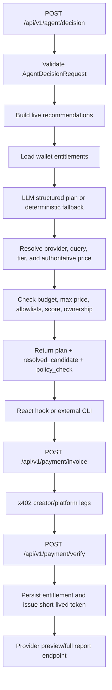
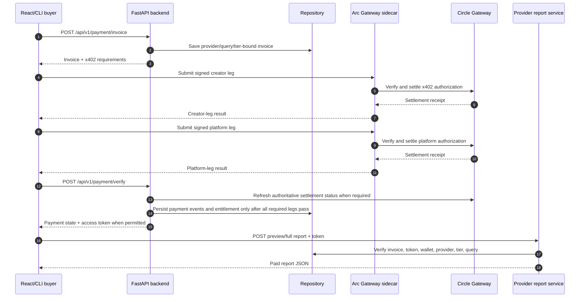

# QMA Backend

The active backend source of truth is `backend/app/`. It is a FastAPI
application composed from endpoint factories, schemas, services, repositories,
and core process state.

The root `main.py` is only the Render-compatible shim. It exports the same
`backend.app.main.app` object and keeps `uvicorn main:app` and legacy tests
working. It is not a second business-logic implementation.

## Runtime and ownership

```text
Render / local uvicorn
        |
        v
root main.py (compatibility shim)
        |
        v
backend.app.main:app
        |
        +--> endpoint factory under api/v1/endpoints/
        +--> Pydantic schema under schemas/
        +--> service under services/
        +--> repository / external client
        +--> JSON or Supabase persistence selected by configuration
```

`backend/app/api/v1/router.py` is a reusable aggregation module, but the
running app currently registers the factory routers directly in
`backend/app/main.py`. Do not infer runtime registration from the comment in
the aggregation module alone.

## Endpoint groups

| Group | Runtime owner | Main responsibilities |
| --- | --- | --- |
| Health/config | `endpoints/health.py` | health, public config, gateway info, engine profile |
| Market/agent discovery | `endpoints/market.py` | live anomalies, market cache, agent recommendations |
| Agent decision | `endpoints/agent.py` | `POST /api/v1/agent/decision` shared by React and CLI |
| Providers/marketplace | `endpoints/providers.py` | provider catalog, applications, approval, provider stats |
| Payments | `endpoints/payments.py` | invoice, status, verify, settlement, withdraw |
| Reports | `endpoints/reports.py` | provider-bound preview/full report access |
| Wallets/profile | `endpoints/wallets.py` | wallet session, summary, payment history, balances |
| Platform | `endpoints/platform.py` | platform summary, payments, payers, metrics |
| Internal | `endpoints/internal.py` | authenticated gateway callbacks and split-leg operations |
| Chat | `endpoints/chat.py` | chat/copilot boundary where enabled |

## Shared agent decision flow

The decision route is deliberately not a payment executor. It resolves a
canonical candidate and policy result; the caller decides whether to continue
to invoice/payment.



The LLM may propose only a minimal plan. It never supplies the authoritative
price, recipient, query, invoice secret, split leg, settlement id, access
token, or report content.

## Payment and unlock sequence



Required invariants:

- one invoice binds amount, asset, network, provider, tier, query fingerprint,
  and payer wallet;
- a split invoice does not issue a new access token until every required leg
  is accepted/final according to the active settlement policy;
- expired, failed, or disputed invoices do not unlock reports;
- retries are idempotent and must not duplicate payment events or entitlements;
- report access is wallet-bound and token expiry is enforced server-side.

## Persistence boundary

Endpoint code delegates state changes through services and the repository
boundary. The active deployment may use JSON-compatible storage or Supabase
depending on configuration. Do not assume the authoritative store from a file
name; inspect `backend/app/core/config.py`, repository initialization, and the
deployment environment before changing persistence behavior.

## Local development

From the repository root:

```powershell
python -m uvicorn main:app --reload --host 127.0.0.1 --port 8000
```

The canonical module can also be started directly:

```powershell
python -m uvicorn backend.app.main:app --reload --host 127.0.0.1 --port 8000
```

Run the gateway sidecar separately when testing real x402 integration:

```powershell
cd arc_gateway
npm install
npm start
```

Read [`PAYMENT_FLOW.md`](../PAYMENT_FLOW.md) before changing payment or
settlement behavior. Read [`docs/DEPLOYMENT_SETUP.md`](../docs/DEPLOYMENT_SETUP.md)
before changing Render startup or service variables.

## Verification

```powershell
python -m pytest -q
```

For the agent boundary, run the targeted decision tests and an HTTP smoke test
against a local server. Do not use live Circle, Supabase, or real funds for
contract tests.
