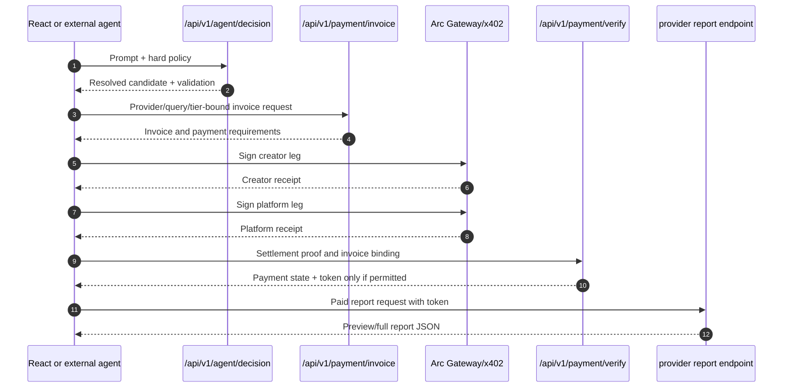

# QMA Agent API

QMA exposes the same paid-intelligence decision boundary to the React UI and
external agents. The browser is optional; the backend API is the contract.

## Agent decision contract

```http
POST /api/v1/agent/decision
Content-Type: application/json
```

Example no-spend request:

```json
{
  "prompt": "Find the best preview report under 0.01 USDC",
  "budget_usdc": 0.01,
  "max_price_usdc": 0.005,
  "allowed_providers": ["funding_memory", "oi_memory"],
  "allowed_tiers": ["preview", "full"],
  "limit": 25,
  "use_llm": false
}
```

The endpoint:

1. loads recommendations and wallet entitlements;
2. optionally asks the configured backend LLM for a minimal plan;
3. resolves the candidate from authoritative QMA data;
4. validates provider, tier, price, budget, score, ownership, and query;
5. returns a decision for the caller to accept or reject.

The response includes:

```text
status
plan
validation
resolved_candidate
canonical_query
policy_check
rejected_candidates
evaluated_candidates
candidate_count
decision_source
```

The LLM cannot supply an invoice secret, payment recipient, split leg, access
token, settlement id, or report content.

## Buyer sequence



## Consumers

The React UI calls this same endpoint through
`frontend/src/services/agent.ts` and `frontend/src/hooks/useAgentBuyer.ts`.
The external CLI calls it through `examples/agent_session.mjs` or
`examples/agent_buyer.mjs`. Both consumers must treat the backend response as
the canonical decision boundary and must not reconstruct provider prices or
entitlements independently.

CLI commands, Circle wallet setup, dry-run/live behavior, and troubleshooting
belong to [examples/README.md](../examples/README.md). The bounded polling
policy and session accounting belong to
[AUTONOMOUS_AGENT.md](AUTONOMOUS_AGENT.md). Payment invariants belong to
[`../PAYMENT_FLOW.md`](../PAYMENT_FLOW.md).
