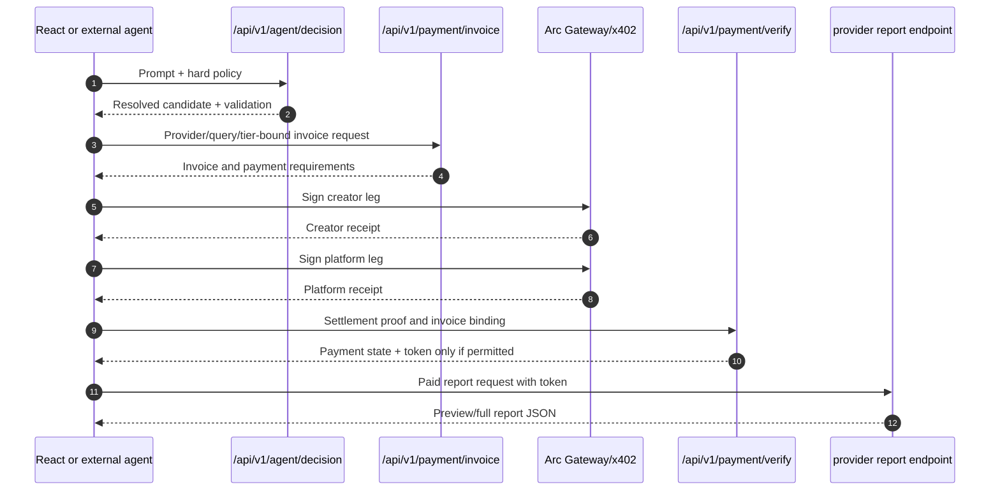

# QMA Agent API

QMA exposes the same paid-intelligence decision boundary to the React UI and
external agents. The browser is optional; the backend API is the contract.

## Agent decision contract

```http
POST /api/v1/agent/decision
Content-Type: application/json
```

Example no-spend request:

```json
{
  "prompt": "Find the best preview report under 0.01 USDC",
  "budget_usdc": 0.01,
  "max_price_usdc": 0.005,
  "allowed_providers": ["funding_memory", "oi_memory"],
  "allowed_tiers": ["preview", "full"],
  "limit": 25,
  "use_llm": false
}
```

The endpoint:

1. loads recommendations and wallet entitlements;
2. optionally asks the configured backend LLM for a minimal plan;
3. resolves the candidate from authoritative QMA data;
4. validates provider, tier, price, budget, score, ownership, and query;
5. returns a decision for the caller to accept or reject.

The response includes:

```text
status
plan
validation
resolved_candidate
canonical_query
policy_check
rejected_candidates
evaluated_candidates
candidate_count
decision_source
```

The LLM cannot supply an invoice secret, payment recipient, split leg, access
token, settlement id, or report content.

## Buyer sequence



## CLI commands

Build the typed package:

```powershell
npm run agent:build
```

Single-purchase dry-run:

```powershell
npm run agent -- --api http://127.0.0.1:8000 --dry-run --run-once --budget 0.05 --max-price 0.005
```

Bounded repeated dry-run:

```powershell
npm run agent -- --api http://127.0.0.1:8000 --dry-run --duration 10m --poll 60 --budget 1 --max-price 0.005
```

Single-purchase compatibility example:

```powershell
node examples/agent_buyer.mjs --api http://127.0.0.1:8000 --llm --dry-run --prompt "Find the best preview report under 0.01 USDC"
```

Live mode requires an explicitly funded Arc Testnet wallet and may spend USDC:

```powershell
$env:AGENT_PRIVATE_KEY="0xYOUR_TEST_WALLET_PRIVATE_KEY"
npm run agent -- --api https://qma-api-rebuild.onrender.com --live --budget 0.01 --max-price 0.005 --no-auto-deposit
```

The CLI loads `QMA_API_URL` from the repository-root `.env`; `agents/.env` is
not an override for the root wrapper. Pass `--api` when the target must be
unambiguous. The rebuild deployment route is unavailable if its Render service
has not deployed the branch containing `/api/v1/agent/decision`.

## Dry-run and LLM semantics

`--dry-run` on the bounded session simulates the selected purchase and creates
no invoice. The backend decision may use OpenAI Structured Outputs when
`OPENAI_API_KEY` is configured; otherwise it falls back to deterministic
policy parsing. A session sends `use_llm=false` on each poll after any optional
one-time policy parse so polling does not repeatedly call the LLM.

The frontend uses the same decision endpoint through
`frontend/src/services/agent.ts` and `frontend/src/hooks/useAgentBuyer.ts`.
