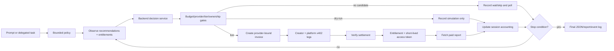

# QMA Bounded Autonomous Agent

QMA separates task interpretation, authoritative decisioning, bounded session
control, and payment execution. The current agent is autonomous within an
explicit policy; it is not an unrestricted wallet daemon.

## End-to-end flow



## Decision boundary

The shared endpoint is:

```http
POST /api/v1/agent/decision
Content-Type: application/json
```

Request fields:

```json
{
  "prompt": "Find the best preview report under 0.01 USDC",
  "wallet": "0x...",
  "budget_usdc": 0.01,
  "max_price_usdc": 0.005,
  "limit": 25,
  "allowed_providers": ["funding_memory", "oi_memory"],
  "allowed_tiers": ["preview", "full"],
  "minimum_score": 0,
  "use_llm": false
}
```

The response contains `plan`, `resolved_candidate`, `policy_check`,
`rejected_candidates`, `evaluated_candidates`, `selection_basis`, and
`decision_source`. Each evaluated candidate includes an `eligible` flag and
the backend-selected candidate is marked with `status=selected`. The session
tries that candidate first, then can route to another eligible provider if the
selected payment fails.
backend resolves the authoritative query, provider, tier, and price. LLM
output cannot provide invoice secrets, recipients, split legs, settlement ids,
access tokens, or report data.

## Session sequence

```mermaid
sequenceDiagram
    autonumber
    actor Operator
    participant CLI as agent_session.mjs
    participant Loop as agents session loop
    participant API as QMA FastAPI
    participant Buyer as agent_buyer.mjs
    participant Gateway as Arc Gateway/Circle

    Operator->>CLI: Set prompt, budget, max price, bounds
    CLI->>Loop: Normalize policy and initialize accounting
    Loop->>API: Poll decision with use_llm=false
    API-->>Loop: Canonical candidate or rejection set
    Loop->>Loop: Apply policy and cooldown/ownership checks
    alt dry-run
        Loop-->>Loop: Simulate result, no invoice/funds
    else live
        Loop->>Buyer: Execute selected candidate
        Buyer->>API: Create invoice
        Buyer->>Gateway: Sign/settle required x402 legs
        Gateway-->>Buyer: Settlement receipts
        Buyer->>API: Verify and fetch report
        API-->>Buyer: Token/report or explicit failure
        Buyer-->>Loop: PurchaseResult
    end
    Loop->>Loop: Record spend, action, failure, cooldown
    Loop-->>CLI: Stop reason and final report
```

## Bounds and commands

No loop bound means one safe poll (`run_once`). Repeated operation must be
explicit:

```powershell
npm run agent:build

# One no-spend observation and simulated purchase
npm run agent -- --api http://127.0.0.1:8000 --dry-run --run-once --budget 1 --max-price 0.005

# Repeat for a bounded duration
npm run agent -- --api http://127.0.0.1:8000 --dry-run --duration 10m --poll 60 --budget 1 --max-price 0.005

# Stop after at most three live purchases
npm run agent -- --api https://qma-api-rebuild.onrender.com --live --max-purchases 3 --budget 0.05 --max-price 0.005 --no-auto-deposit
```

Optional output controls are `--json`, `--report-file`, `--event-log`, and
`--verbose`. Failure handling can be tuned with `--failure-cooldown` and
`--max-failures`; defaults are 300 seconds of backoff and two attempts per
provider/symbol. Ctrl+C stops between safe loop steps; it does not cancel a
wallet transaction that has already been submitted.

## Human-facing CLI direction

The current implementation is flag-driven so that local tests, CI, and recorded
demos are reproducible. The recommended human-facing command is intentionally
short:

```powershell
npm run agent
```

The next CLI UX layer should ask once for mode, session budget, maximum report
price, provider/tier allowlists, loop bounds, poll interval, executor, and
Circle Agent Wallet address. It should show the resulting policy and require
confirmation before live spending, then reuse that immutable policy for all
polls in the session.

This wizard is not yet present in the runtime. Until it is implemented, use
the explicit flag commands above. Do not describe the current `npm run agent`
command as interactive.

Any future persisted session must contain only non-secret policy and accounting
data. Private keys, OTPs, Circle CLI sessions, invoice secrets, and access
tokens must remain outside session files.

## Safety boundary

- Dry-run does not create an invoice or spend USDC.
- Live mode delegates to the existing buyer executor and may request real Arc
  Testnet signatures.
- `--auto-deposit` is an additional Gateway funding transaction.
- A connected browser wallet or `AGENT_PRIVATE_KEY` is an authorization
  boundary; neither is needed for decision-only dry-runs.
- The backend remains authoritative for payment, settlement, entitlement, and
  access-token issuance.

Circle Agent Wallet is an available opt-in executor for the CLI through
`--executor circle-agent-wallet`. It has been exercised on Arc Testnet, but it
is still separate from the browser wallet flow. A hosted browser mode must not
reuse Circle CLI credentials or OTP sessions; it requires a separate
server-side wallet-session design and additional runtime verification.
