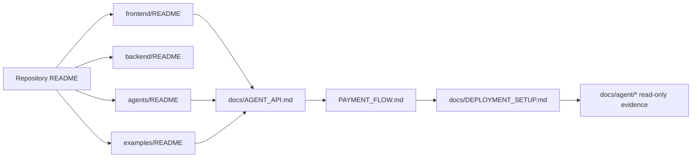

# QMA Documentation Map

Use this map to find the owner of a behavior. Not every directory needs a
separate README: a README belongs at a reusable boundary, while cross-cutting
contracts belong under `docs/`.

## Where the detailed flow lives

| Area | Primary documentation | What it owns |
| --- | --- | --- |
| Repository/system | [`../README.md`](../README.md) | product story, branch split, high-level architecture |
| Backend/API | [`../backend/README.md`](../backend/README.md) | FastAPI composition, route groups, service/repository flow, payment invariants |
| React frontend | [`../frontend/README.md`](../frontend/README.md) | routes, state/services, API base, browser agent flow |
| Typed agent package | [`../agents/README.md`](../agents/README.md) | contracts, policy, session loop, bounds, signer boundary |
| External CLI buyer | [`../examples/README.md`](../examples/README.md) | commands and live/dry-run buyer execution |
| Agent HTTP contract | [`AGENT_API.md`](AGENT_API.md) | decision endpoint and purchase sequence |
| Autonomous session | [`AUTONOMOUS_AGENT.md`](AUTONOMOUS_AGENT.md) | bounded session policy, accounting, stop conditions |
| Payment lifecycle | [`../PAYMENT_FLOW.md`](../PAYMENT_FLOW.md) | invoice, x402, split legs, verify, entitlement, unlock |
| Deployment | [`DEPLOYMENT_SETUP.md`](DEPLOYMENT_SETUP.md) | Render/Vercel branch and environment setup |
| Security | [`API_SECURITY.md`](API_SECURITY.md) | auth, rate limits, provider/admin boundaries |
| Persistence | [`SUPABASE.md`](SUPABASE.md) | JSON/Supabase schema and migration operations |
| Legacy cutover | [`agent/`](agent/) | read-only parity, gap, and deletion evidence |

## Runtime ownership map



## Documentation rules

- Backend README documents the active implementation, not the legacy
  `main_ref.py` snapshot.
- Frontend README documents `frontend/src`; it does not document legacy CSS or
  root HTML behavior except where deployment/cutover requires the distinction.
- Agent README documents policy/session boundaries. It must not imply that
  dry-run spent funds or that an LLM is trusted with payment authority.
- `PAYMENT_FLOW.md` is currently at repository root. The historical audit
  references an intended `docs/agent/PAYMENT_FLOW.md` path; no file move is
  performed by this documentation update.
- `docs/agent/LEGACY_*` and `CUTOVER_REPORT.md` are audit evidence. Update them
  only when creating a new audit result; do not rewrite historical findings to
  make current architecture look cleaner.

## Verification commands

```powershell
python -m pytest -q
cd frontend; npm run typecheck; npm run build
cd ..\agents; npm run test
cd ..; node --check examples/agent_session.mjs
```

The commands verify source/build contracts. They do not constitute a browser
run, a live Circle settlement, or a production deployment check.
