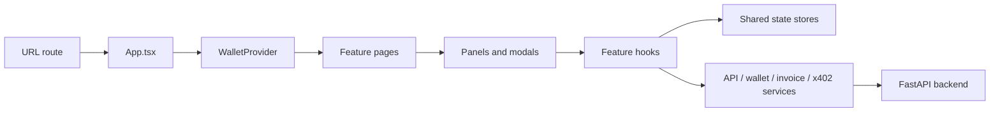
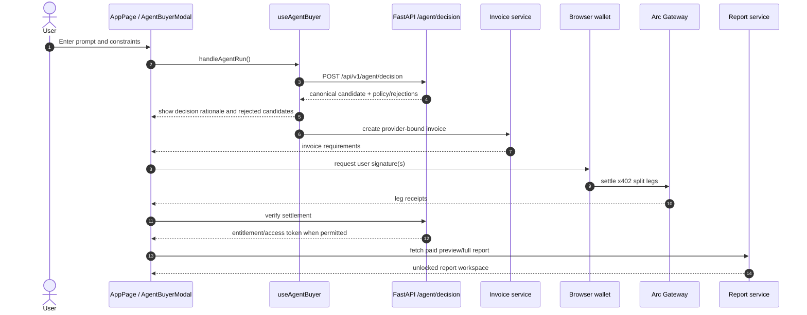

# QMA React Frontend

This directory contains the active Vite + React + TypeScript application on
branch `frontend/vite-react-rebuild`. It is the rebuild frontend, separate
from the root legacy HTML files and `public/app.js`/`public/*.css`.

## Application shape

```text
frontend/src/main.tsx
        |
        v
src/app/App.tsx
        |
        +--> routeFromPath() / history + popstate
        +--> WalletProvider (shared connected-wallet state)
        +--> LandingPage       /
        +--> AppPage           /app
        +--> ProfileOrdersPage /profile
        +--> MarketplaceReview /marketplace
```



## Routes and source of truth

| Route | Page owner | Main behavior |
| --- | --- | --- |
| `/` | `components/landing/LandingPage.tsx` | product landing and navigation |
| `/app` | `components/reports/AppPage.tsx` | live signals, query, payment, report workspace, agent UI |
| `/profile` | `components/profile/ProfileOrdersPage.tsx` | wallet-bound profile, purchased reports, payment history |
| `/marketplace` | `components/marketplace/MarketplaceReview.tsx` | provider catalog and creator review/apply flows |

`App.tsx` owns only route composition and the wallet provider. Feature state
belongs in feature hooks/components; API and payment boundaries belong in
`services/`; reusable cross-page wallet state belongs in `state/walletStore.tsx`.

## API base URL

`src/services/api.ts` resolves the API base in this order:

1. `VITE_QMA_API_BASE_URL` when supplied;
2. empty string on local hostnames, so Vite can proxy/same-origin with a local
   FastAPI server;
3. the legacy fallback `https://qma-api.onrender.com` when no rebuild API is
   configured.

For the rebuild preview deployment, set:

```env
VITE_QMA_API_BASE_URL=https://qma-api-rebuild.onrender.com
VITE_QMA_ENV=preview
VITE_QMA_SYNTHETIC_RUN=false
```

Never place service-role keys, admin tokens, access-token secrets, gateway
secrets, or private keys in Vite variables.

## Agent UI flow

The browser agent uses the same backend decision boundary as the CLI. The
browser wallet remains the authorization boundary for live payment.



If the decision endpoint is unavailable and a wallet is connected, live
autonomous execution is blocked. The wallet must never bypass the backend
decision and payment checks. A wallet-less local/demo path may use its local
recommendation fallback for presentation only.

## Shared state and service boundaries

- `state/walletStore.tsx`: connected wallet address, persistence key, and
  disconnect cleanup shared by app/profile/marketplace.
- `state/reportStore.ts`: report display state when used by a feature owner.
- `state/invoiceStore.ts`: invoice state boundary available for payment-hook
  integration; current AppPage flows still own some invoice orchestration.
- `hooks/useWalletConnection.ts`: injected-wallet connection, chain checks, and
  signing prerequisites.
- `hooks/usePendingInvoiceCache.ts`: resumable invoice/report cache helpers.
- `hooks/usePayment.ts`: payment lifecycle orchestration.
- `hooks/useAgentBuyer.ts`: browser agent session UI state and calls to the
  shared decision service.
- `services/invoices.ts`, `reports.ts`, `agent.ts`, and `x402.ts`: network and
  payment integration boundaries.

Do not move signing, settlement verification, entitlement issuance, or access
token validation into presentational components.

## Development and verification

```powershell
cd frontend
npm install
npm run dev
npm run typecheck
npm run build
```

The production build is emitted to `frontend/dist/`; never edit it directly.
Direct refreshes of `/app`, `/profile`, and `/marketplace` depend on the SPA
rewrite in the root `vercel.json`.

For payment behavior, consult [`PAYMENT_FLOW.md`](../PAYMENT_FLOW.md)
before editing sensitive services. For deployment, consult
[`docs/DEPLOYMENT_SETUP.md`](../docs/DEPLOYMENT_SETUP.md).
